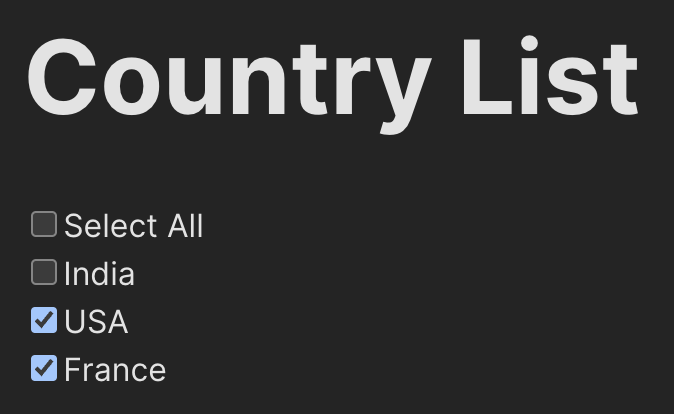

# Zero Workers Code challenge.

Framework and tools: React + TypeScript + Vite

Site URL: https://zero-workers-cc-git-main-germanazo.vercel.app

## Installation 

Clone the repository 

```bash
git clone https://github.com/german-bortoli/zero-workers-cc.git
```

Install dependecies

```bash
cd zero-workers-cc
npm install
```

Launch the application

```bash
npm run dev
```

### Screenshot


